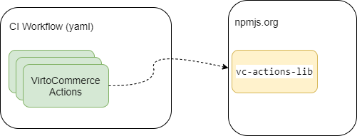
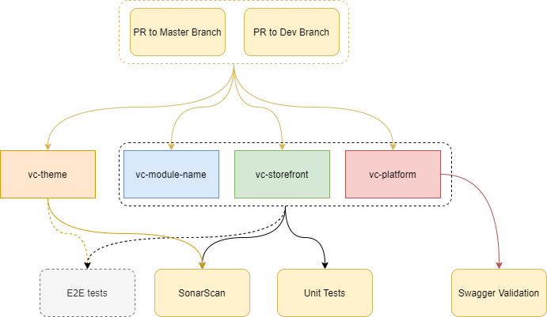
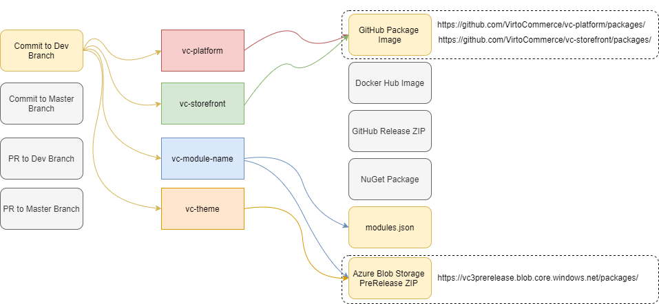
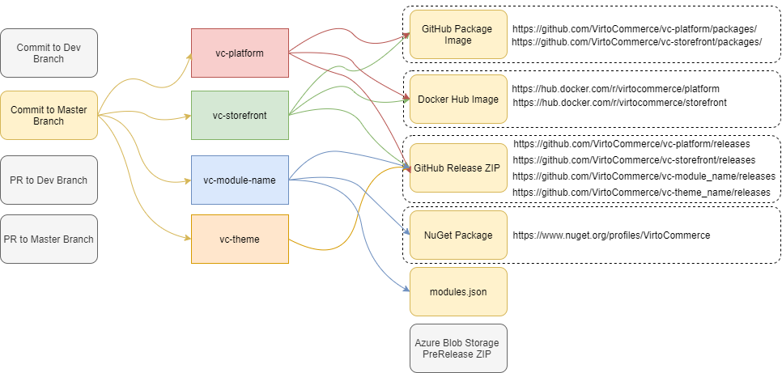
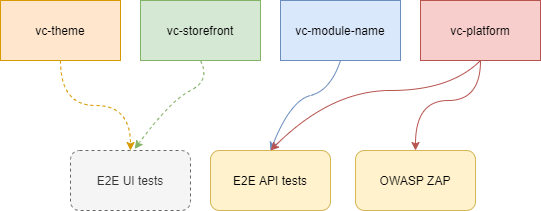
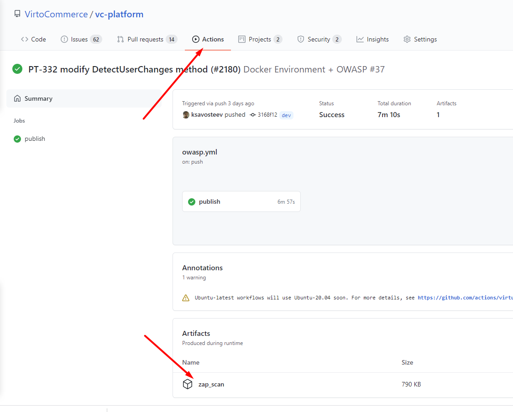
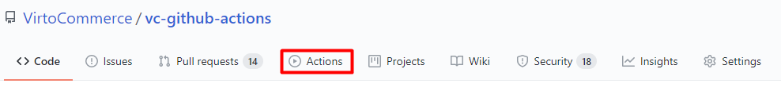
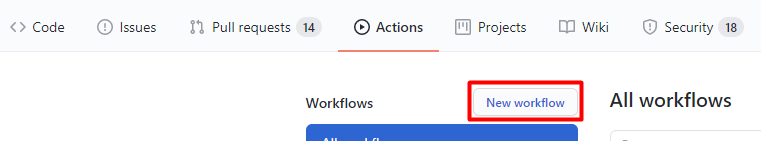
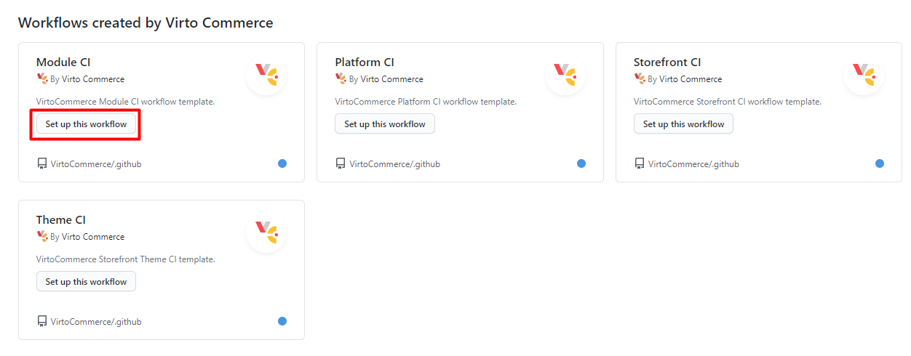

# VirtoCommerce Continuous Integration

## Overview

VirtoCommerce continuous integration based on [GitHub Actions feature](https://docs.github.com/en/free-pro-team@latest/actions/learn-github-actions/introduction-to-github-actions). It contain:

* yaml workflows, placed in Platform, Modules, Storefront and Themes repositories;
* special actions, placed in [VirtoCommerce/vc-github-actions](https://github.com/VirtoCommerce/vc-github-actions) repository;
* shared library, with common used in special actions components, placed in [@virtocommerce/vc-actions-lib](https://www.npmjs.com/package/@virtocommerce/vc-actions-lib)



## Workflows

Two type of workflows have been implemented main workflows and tests automation workflows.

## Main workflow

**Main** workflow implement base VirtoCommerce CI:

* Module CI;
* Platform CI;
* Storefront CI;
* Theme CI.

Workflow triggers automatically on Pull Request or on Push to Master or Dev branches.

On Pull Request event workflows force only code checks


On Push to Dev branch event workflows force code checks, creates artifacts for alpha version (pre-release) and publish artifacts to GtHub packages (images for Platform and Storefront) or to Azure Blob Storage (zipped binaries for Modules or Themes).



On Push to Master branch event workflows force code checks, creates artifacts for release version and publish artifacts to GtHub releases (zipped binaries for Platform, Storefront, Modules and Themes) to GtHub packages and Docker hub (images for Platform and Storefront). Also Nuget packages publish to [VirtoCommerce Nuget Gallery](https://www.nuget.org/profiles/VirtoCommerce).



### Release alpha version

To crete artifacts for alpha version (pre-release) run manually main workflow from specified branch. It create alpha version artifacts and publish it to GtHub packages (images for Platform and Storefront) or to Azure Blob Storage (zipped binaries for Modules or Themes).

## Tests automation workflows



### OWASP ZAP

**OWASP ZAP** workflow implements dynamic application security testing. Workflow triggers automatically on Push to Dev branch or manually. The testing result report placed in workflow artifacts.



Read more about [OWASP ZAP](https://www.zaproxy.org/docs/docker/full-scan/)

### E2E API tests

**Platform E2E** workflow runs API tests for platform and modules (in commerce bundle) endpoints. Workflow triggers automatically on Pull Request to Master or Dev branch or manually. When workflow runs manually `testSuite` parameter should be specified. A test suite is a collection of multiple different or duplicate test cases in [Katalone](https://docs.katalon.com/) test project. Default value is `Test Suites/Platform_start`.

**Module E2E** workflow runs API tests for current module (repository where workflow runs) and all dependend modules endpoints.

Actual API tests you can find in [vc-quality-gate-katalon](https://github.com/VirtoCommerce/vc-quality-gate-katalon) repository.

## Secrets

Create GitHub organization level secrets:

* REPO_TOKEN - Github user token, with access to organization repositories;
* BLOB_TOKEN - connection string to Azure Blob Storage;
* DOCKER_USERNAME - DockerHub user name,  with publish images privileges;
* DOCKER_TOKEN - DockerHub user token,  with publish images privileges;
* NUGET_KEY - Nuget repository key;
* SONAR_TOKEN - SonarCloud access token, with Execute Analysis and Create Project privileges.

## How to enable workflow in a repository

1. Navigate to the main page of the repository.
1. Click **Actions**.

1. If your repository already has existing workflows click **New workflow**.

1. Choose template you'd like to use in the "Workflows created by Virto Commerce" section. Click **Set up this workflow**.

1. For private repository create [Secrets](#Secrets) on repository level.


## vc-github-actions repository

VirtoCommerce specific GitHub actions and actions common components lib.

### Actions

* [Add version suffix](/add-version-suffix/README.md)
* [Build Docker image](/build-docker-image/README.md)
* [Build Theme](/build-theme/README.md)
* [Build Vue Theme](/build-vue-theme/README.md)
* [Changelog generator](/changelog-generator/README.md)
* [Deploy Workflow](/deploy-workflow/README.md)
* [Docker Check Modules](/docker-check-modules/README.md)
* [Docker Env](/docker-env/README.md)
* [Docker Install Modules](/docker-install-modules/README.md)
* [Docker Install Sampledata](/docker-install-sampledata/README.md)
* [Docker Install Theme](/docker-install-theme/README.md)
* [Docker Restore Dump](/docker-restore-dump/README.md)
* [Docker Start Environment](/docker-start-environment/README.md)
* [Docker Validate Swagger](/docker-validate-swagger/README.md)
* [Get Image version](/get-image-version/README.md)
* [Katalon Studio Github action](/katalon-studio-github-action/README.md)
* [Publish Blob Release](/publish-blob-release/README.md)
* [Publish Docker Image](/publish-docker-image/README.md)
* [Publish Github Release](/publish-github-release/README.md)
* [Publish Katalon Report](/publish-katalon-report/README.md)
* [Publish Module Manifest](/publish-manifest/README.md)
* [Publish Nuget packages](/publish-nuget/README.md)
* [Publish Theme](/publish-theme/README.md)
* [Setup credentials for git](/setup-git-credentials-github/README.md)
* [setup vcbuild](/setup-vcbuild/README.md)
* [SonarQube Quality Gate check](/sonar-quality-gate/README.md)
* [SonarQube .net Analysis start](/sonar-scanner-begin/README.md)
* [SonarQube .net Analysis finish](/sonar-scanner-end/README.md)
* [SonarQube Theme Analysis](/sonar-theme/README.md)
* [Swagger validation](/docker-env/README.md)
* [Sync Modules Workflows](/sync-module-cicd/README.md)
* [Actions components lib](/vc-actions-lib/README.md)

## Supply-chain security: pinned third-party actions

Every third-party `uses:` reference in this repo (anything not under `VirtoCommerce/*`) is pinned to a full 40-character commit SHA with a trailing `# tag` comment, per the [GitHub Actions hardening guide](https://docs.github.com/en/actions/security-for-github-actions/security-guides/security-hardening-for-github-actions#using-third-party-actions). Tags are mutable; SHAs are not.

```yaml
# Correct
uses: actions/checkout@de0fac2e4500dabe0009e67214ff5f5447ce83dd # v6

# Rejected by CI
uses: actions/checkout@v6
```

**How updates happen**

- **Dependabot** (`.github/dependabot.yml`) scans `.github/workflows/` and every `**/action.yml` weekly. When upstream cuts a new tag, it opens a grouped PR bumping the SHA + trailing comment.
- **Pin-check CI** (`.github/workflows/pin-check.yml`) runs `pinact run -check` on every PR that touches workflows or `action.yml` files. PRs with unpinned third-party `uses:` lines fail.
- **Scope** is configured in [`.pinact.yaml`](.pinact.yaml) — `VirtoCommerce/*` is intentionally ignored (internal, not third-party).

**For contributors**

- When adding a new third-party action, write the SHA, not the tag. Quick lookup:

  ```sh
  gh api repos/OWNER/REPO/commits/TAG --jq '.sha'
  ```

- `VirtoCommerce/vc-github-actions/<dir>@master` and other `VirtoCommerce/*` refs remain version-/branch-pinned as before.

## Bundled Node actions: build and dependency hygiene

Most actions in this repo are TypeScript sources bundled into a single `dist/index.js` via [`@vercel/ncc`](https://github.com/vercel/ncc) and committed alongside the source. GitHub Actions loads the committed bundle directly; consumers reference `VirtoCommerce/vc-github-actions/<action>@master` and never run `npm install` themselves.

**Per-action layout**

Two source shapes are in use. Both bundle to the same `dist/` and use the same workflows.

```
# TypeScript source (most common — publish-artifact-link, get-jira-keys, ...)
<action>/
├── action.yml              # runs.main: dist/index.js
├── package.json            # has "scripts": { "build": "ncc build src/index.ts ..." }
├── package-lock.json       # pinned, committed
├── tsconfig.json
├── src/index.ts            # TypeScript source
└── dist/                   # committed build output (LF, enforced via .gitattributes)
    ├── index.js
    ├── index.js.map
    ├── sourcemap-register.js
    └── licenses.txt

# Root-JS source (changelog-generator, build-docker-image,
#                 get-image-version, publish-nuget, sonar-scanner-end)
<action>/
├── action.yml              # runs.main: dist/index.js
├── package.json            # "scripts": { "build": "ncc build index.js ..." }
├── package-lock.json
├── index.js                # CommonJS source at the action root
└── dist/                   # same shape as above
```

`node_modules/` is gitignored repo-wide; never commit it.

**Local rebuild after a source change**

```sh
cd <action>
npm ci          # reproducible install from package-lock.json
npm run build   # ncc bundles src/index.ts → dist/
git add dist/ package.json package-lock.json
```

`npm ci` (not `npm install`) is mandatory so everyone — contributors and CI — uses the exact `@vercel/ncc` version locked in `package-lock.json`. A mismatched ncc version reorders bundle output and produces churn.

**How updates happen**

- **Dependabot npm** (`.github/dependabot.yml`) opens one weekly PR per action grouping minor + patch updates, and individual PRs for majors. The 10-PR-at-a-time limit keeps the queue manageable.
- **`dependabot-rebuild` workflow** (`.github/workflows/dependabot-rebuild.yml`) reacts to every Dependabot PR by running `npm ci && npm run build` in each affected action and pushing the rebuilt `dist/` back to the PR branch. Non-npm Dependabot PRs (e.g. github-actions ecosystem bumps) no-op cleanly because the per-action change detector finds no `package.json` / `package-lock.json` deltas to act on. Without this workflow, every Dependabot npm PR would fail `check-dist` because the bundle would be stale by construction.
- **`check-dist` workflow** (`.github/workflows/check-dist.yml`) runs on every PR that touches `*/src/**`, `*/package.json`, `*/package-lock.json`, or `*/tsconfig.json`. It rebuilds the affected `dist/` and fails the PR if the result differs from what's committed. This catches both human "edited `src/` but forgot to rebuild" mistakes and silent dependency drift.

**Adding a new bundled Node action**

1. Create the directory with `action.yml` (`runs.main: dist/index.js`) and a `package.json` modelled on one of:
   - **TypeScript** ([publish-artifact-link/package.json](publish-artifact-link/package.json)) — also add `tsconfig.json` and `src/index.ts`:
     ```json
     "scripts": {
       "build": "ncc build src/index.ts -o dist --source-map --license licenses.txt"
     },
     "devDependencies": {
       "@vercel/ncc": "^0.38.0",
       "typescript": "^5.8.3"
     }
     ```
   - **JavaScript** ([build-docker-image/package.json](build-docker-image/package.json)) — source lives at the action root as `index.js`:
     ```json
     "scripts": {
       "build": "ncc build index.js -o dist --source-map --license licenses.txt"
     },
     "devDependencies": {
       "@vercel/ncc": "^0.38.0",
       "typescript": "^5.8.3"
     }
     ```
   For runtime dependencies, prefer `@actions/github@^5.0.0` (or newer). v4 ships a transitive `@actions/http-client@1.x` that uses the deprecated Node `url.parse()` API and emits `DEP0169` warnings under Node 24+.
2. `npm install` to generate `package-lock.json`, then `npm run build` to produce `dist/`.
3. Commit `package.json`, `package-lock.json`, the source file(s), `action.yml`, and the whole `dist/` directory.

Dependabot picks up the new directory automatically on the next scheduled run; `check-dist` enforces the bundle on every subsequent PR.

**Legacy unbundled actions**

A handful of older actions predate the ncc convention and ship a different way: `action.yml` points `runs.main` at a hand-written `index.js` at the action root (not `dist/index.js`), and the action's entire `node_modules/` tree is committed to git as the deployment artifact. At runtime, `require()`s in the root `index.js` resolve through that tree.

These actions are:

```
add-version-suffix, build-theme, build-vue-theme,
katalon-studio-github-action, publish-docker-image, publish-theme,
setup-vcbuild, sonar-scanner-begin, sonar-theme
```

Repo-wide [`.gitignore`](.gitignore) excludes `node_modules/` by default but un-ignores these nine directories so their committed trees keep tracking. They are **not** covered by `check-dist` (no `build` script) and Dependabot npm PRs land without an automatic rebuild — a maintainer must `npm install` locally and commit the updated `node_modules/`.

Each is a candidate for migration to the ncc pattern: add `src/index.ts` (port the JS), a `tsconfig.json`, a `build` script, switch `action.yml` to `main: dist/index.js`, and remove the gitignore exception. Untracked until that migration happens.

**Limitations**

- `docker-install-theme` predates this convention from a different direction — it has `main: dist/index.js` but no `package.json`. Its existing `dist/` works in production, but it's invisible to Dependabot and `check-dist` until reconstructed.
- This pipeline catches build-time breakage (TS compile errors, missing modules, stale bundle). It does **not** validate that the action still works against its real consumers — that's a separate canary-tier concern, deferred until consumers move off `@master` onto a moving major-version tag.
