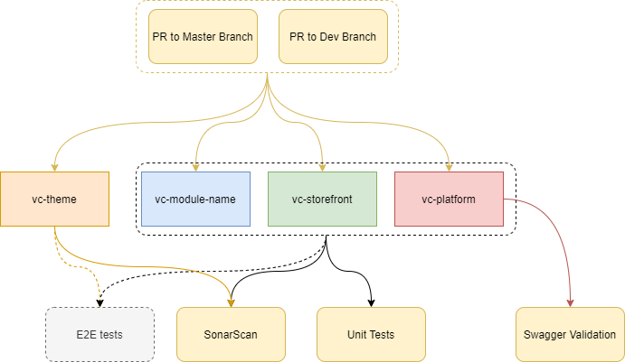
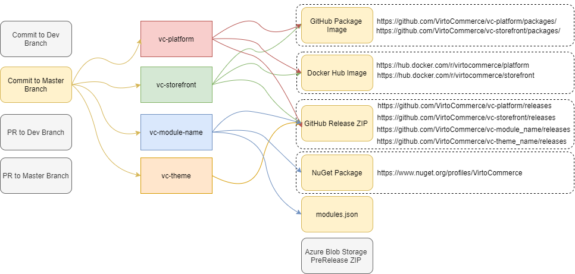
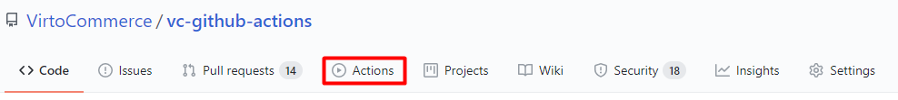
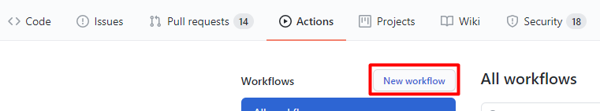

# VirtoCommerce Continuous Integration

## Overview

VirtoCommerce continuous integration based on [GitHub Actions feature](https://docs.github.com/en/free-pro-team@latest/actions/learn-github-actions/introduction-to-github-actions). It contain:

* yaml workflows, placed in Platform, Modules, Storefront and Themes repositories;
* special actions, placed in [VirtoCommerce/vc-github-actions](https://github.com/VirtoCommerce/vc-github-actions) repository;
* shared library, with common used in special actions components, placed in [@virtocommerce/vc-actions-lib](https://www.npmjs.com/package/@virtocommerce/vc-actions-lib)

## Workflows

Two type of workflows have been implemented main workflows and tests automation workflows.

## Main workflow

**Main** workflow implement base VirtoCommerce CI:

* Module CI;
* Platform CI;
* Storefront CI;
* Theme CI.

Workflow triggers automatically on Pull Request or on Push to Master or Dev branches.

On Pull Request event workflows force only code checks

On Push to Dev branch event workflows force code checks, creates artifacts for alpha version (pre-release) and publish artifacts to GtHub packages (images for Platform and Storefront) or to Azure Blob Storage (zipped binaries for Modules or Themes).

On Push to Master branch event workflows force code checks, creates artifacts for release version and publish artifacts to GtHub releases (zipped binaries for Platform, Storefront, Modules and Themes) to GtHub packages and Docker hub (images for Platform and Storefront). Also Nuget packages publish to [VirtoCommerce Nuget Gallery](https://www.nuget.org/profiles/VirtoCommerce).

### Release alpha version

To crete artifacts for alpha version (pre-release) run manually main workflow from specified branch. It create alpha version artifacts and publish it to GtHub packages (images for Platform and Storefront) or to Azure Blob Storage (zipped binaries for Modules or Themes).

## Tests automation workflows

### OWASP ZAP

**OWASP ZAP** workflow implements dynamic application security testing. Workflow triggers automatically on Push to Dev branch or manually. The testing result report placed in workflow artifacts.

Read more about [OWASP ZAP](https://www.zaproxy.org/docs/docker/full-scan/)

### E2E API tests

**Platform E2E** workflow runs API tests for platform and modules (in commerce bundle) endpoints. Workflow triggers automatically on Pull Request to Master or Dev branch or manually. When workflow runs manually `testSuite` parameter should be specified. A test suite is a collection of multiple different or duplicate test cases in [Katalone](https://docs.katalon.com/) test project. Default value is `Test Suites/Platform_start`.

**Module E2E** workflow runs API tests for current module (repository where workflow runs) and all dependend modules endpoints.

Actual API tests you can find in [vc-quality-gate-katalon](https://github.com/VirtoCommerce/vc-quality-gate-katalon) repository.

## Secrets

Create GitHub organization level secrets:

* REPO_TOKEN - Github user token, with access to organization repositories;
* BLOB_TOKEN - connection string to Azure Blob Storage;
* DOCKER_USERNAME - DockerHub user name,  with publish images privileges;
* DOCKER_TOKEN - DockerHub user token,  with publish images privileges;
* NUGET_KEY - Nuget repository key;
* SONAR_TOKEN - SonarCloud access token, with Execute Analysis and Create Project privileges.

## How to enable workflow in a repository

1. Navigate to the main page of the repository.
1. Click **Actions**.

1. If your repository already has existing workflows click **New workflow**.

1. Choose template you'd like to use in the "Workflows created by Virto Commerce" section. Click **Set up this workflow**.

1. For private repository create [Secrets](#Secrets) on repository level.

## vc-github-actions repository

VirtoCommerce specific GitHub actions and actions common components lib.

### Actions

* [Add version suffix](/add-version-suffix/README.md)
* [Build Docker image](/build-docker-image/README.md)
* [Build Theme](/build-theme/README.md)
* [Changelog generator](/changelog-generator/README.md)
* [Deploy Workflow](/deploy-workflow/README.md)
* [Docker Check Modules](/docker-check-modules/README.md)
* [Docker Env](/docker-env/README.md)
* [Docker Install Modules](/docker-install-modules/README.md)
* [Docker Install Sampledata](/docker-install-sampledata/README.md)
* [Docker Install Theme](/docker-install-theme/README.md)
* [Docker Restore Dump](/docker-restore-dump/README.md)
* [Docker Start Environment](/docker-start-environment/README.md)
* [Docker Validate Swagger](/docker-validate-swagger/README.md)
* [Get Image version](/get-image-version/README.md)
* [Katalon Studio Github action](/katalon-studio-github-action/README.md)
* [Publish Blob Release](/publish-blob-release/README.md)
* [Publish Docker Image](/publish-docker-image/README.md)
* [Publish Github Release](/publish-github-release/README.md)
* [Publish Katalon Report](/publish-katalon-report/README.md)
* [Publish Module Manifest](/publish-manifest/README.md)
* [Publish Nuget packages](/publish-nuget/README.md)
* [Publish Theme](/publish-theme/README.md)
* [Setup credentials for git](/setup-git-credentials-github/README.md)
* [setup vcbuild](/setup-vcbuild/README.md)
* [SonarQube Quality Gate check](/sonar-quality-gate/README.md)
* [SonarQube .net Analysis start](/sonar-scanner-begin/README.md)
* [SonarQube .net Analysis finish](/sonar-scanner-end/README.md)
* [SonarQube Theme Analysis](/sonar-theme/README.md)
* [Swagger validation](/docker-env/README.md)
* [Sync Modules Workflows](/sync-module-cicd/README.md)
* [Actions components lib](/vc-actions-lib/README.md)